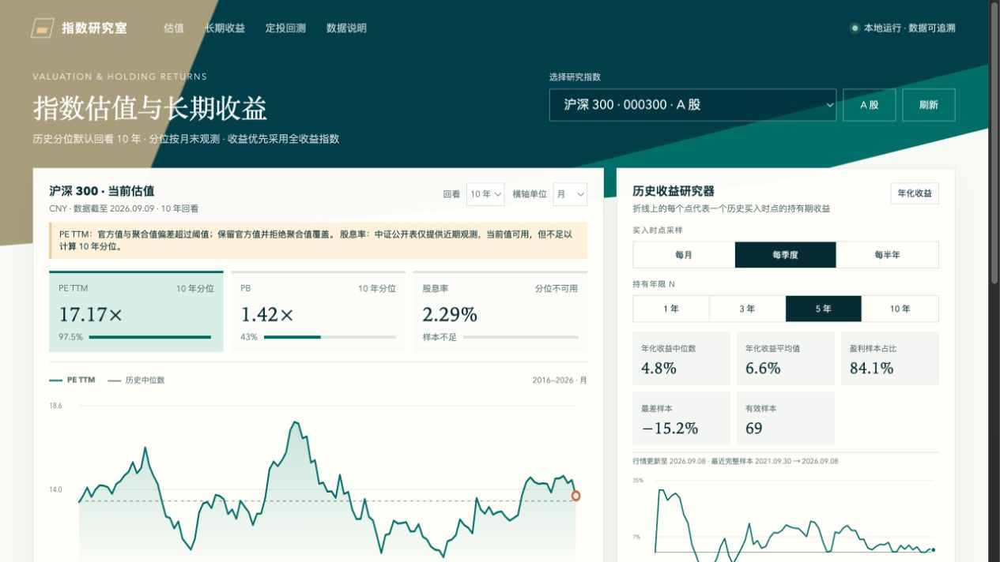

# 指数研究室

一个零凭据、本地运行的 A 股与美股指数研究工具。它把估值、历史持有收益和定投回测放在同一个页面中，并明确展示每项数据的来源、日期与收益口径。

> 本项目仅用于数据研究与学习，不构成投资建议。历史结果不代表未来表现。



## 功能

- 查看 PE、PB、股息率的当前值、历史分位、来源和更新时间。
- 估值折线支持日、月、季度、年四种显示粒度，鼠标或触控滑动可查看具体坐标。
- 按月、季度或半年生成历史买入点，研究持有 1、3、5、10 年的年化或累计收益。
- 收益研究器展示平均值、中位数、盈利样本占比、最差样本和有效样本数。
- 定投回测支持自选日期区间、每月指定日期或每周指定星期，并使用 XIRR 计算年化收益。
- 支持输入另一来源的日期和值进行估值交叉核验。
- 手动刷新远端数据；刷新失败时保留完整缓存并明确标记过期或降级状态。
- 响应式页面，可在桌面和窄屏浏览器中使用。

## 支持的指数

| 市场 | 指数 | 展示代码 | 回测口径 |
| --- | --- | --- | --- |
| A 股 | 沪深 300 | `000300` | 中证全收益指数 |
| A 股 | 中证 500 | `000905` | 中证全收益指数 |
| A 股 | 中证 1000 | `000852` | 中证全收益指数 |
| A 股 | 上证 50 | `000016` | 中证全收益指数 |
| A 股 | 上证红利 | `000015` | 中证全收益指数 |
| A 股 | 300 红利低波 | `930740` | 官方全收益指数 `H20740` |
| A 股 | 红利低波 | `H30269` | 官方全收益指数 `H20269` |
| A 股 | 红利低波 100 | `930955` | 官方全收益指数 `H20955` |
| A 股 | 东证红利低波 | `931446` | 官方全收益指数 `921446` |
| A 股 | 标普中国 A 股大盘红利低波 50 | `SPCLLHCP` | `515450` ETF 前复权日线代理 |
| 美股 | 标普 500 | `SPX` | S&P 500 Total Return Index |
| 美股 | 纳斯达克 100 | `NDX` | 价格指数，不含分红 |

## 快速开始

需要 Python 3.9 或更高版本，以及可访问公共数据源的网络连接。不需要 API Key。

### macOS / Linux

```bash
git clone https://github.com/Alikemomo-scratch/index-invest-web.git
cd index-invest-web
python3 -m venv .venv
source .venv/bin/activate
python3 -m pip install -r requirements.txt
python3 run.py
```

### Windows PowerShell

```powershell
git clone https://github.com/Alikemomo-scratch/index-invest-web.git
cd index-invest-web
py -m venv .venv
.venv\Scripts\Activate.ps1
py -m pip install -r requirements.txt
py run.py
```

启动后访问 [http://127.0.0.1:8000](http://127.0.0.1:8000)。服务只监听本机回环地址，不会主动开放到局域网或互联网。

首次打开某个指数时需要抓取真实数据，可能等待数秒。之后数据会缓存在 `data/index-invest.sqlite3`。点击页面右上角“刷新”可按当前选择强制更新。

## 如何使用

1. 在页面顶部选择指数。
2. 在估值区选择 3–20 年回看范围，以及日/月/季/年的图表粒度。
3. 在历史收益研究器选择买入采样频率和持有年限；点击“年化收益”按钮可切换累计收益。
4. 在定投回测中设置开始日期、结束日期、频率、计划日和每次金额，然后点击“计算”。
5. 如需检查外部 App 或网站中的估值，在“数据核验”中输入参考日期、数值和容差。

历史收益研究只包含已经完整持有 N 年的样本。因此，行情可以更新到今天，而最近可用买入日期会自然停在约 N 年前。

## 数据源与口径

| 用途 | 数据源 | 说明 |
| --- | --- | --- |
| A 股 PE、股息率和指数行情 | 中证指数官网 | 官方数据优先；部分股息率历史仅有近期观察 |
| A 股 PB 与 PE 交叉核验 | 乐咕乐股 | 公共聚合数据，逐项标记来源；不可用时不伪造替代值 |
| 标普 500 估值 | Multpl | 公共历史表，估算观察保留 `estimated` 标记 |
| 美股指数日线 | Yahoo Finance | 标普 500 优先使用全收益指数；纳斯达克 100 为价格指数 |
| 标普中国红利低波代理 | 腾讯证券 | 使用 `515450` ETF 前复权日线，不等同于官方指数全收益 |

免费公共源可能限流、暂时不可用或改变页面格式。本项目会保存来源、抓取时间、覆盖区间和实际回退路径。新数据若疑似截断，不会覆盖更完整的本地缓存。

## 计算说明

- 估值分位：回看区间内按月末最后一个有效观察计算经验分布；少于 36 个样本不输出分位。
- 买入时点：所选月、季度或半年的最后一个有效交易日。
- 持有结束点：目标周年日当天或之前最近的有效交易日。
- 年化收益：`(期末 / 期初) ** (365.2425 / 实际天数) - 1`。
- 平均收益：当前所有完整持有样本收益率的算术平均值。
- 定投执行：计划日休市时顺延至下一有效交易日；超出结束日则不执行。
- 定投年化：使用每笔实际投入日期和期末资产计算 XIRR。
- 回测未计手续费、税费、汇率、通胀和整股限制；ETF 代理还包含基金费率及跟踪误差。

## 本地 API

启动后可直接访问：

```text
GET  /api/health
GET  /api/indices
GET  /api/indices/{index_id}/research
GET  /api/indices/{index_id}/returns
GET  /api/indices/{index_id}/dca
GET  /api/indices/{index_id}/validation
POST /api/refresh/{index_id}
```

FastAPI 自动接口文档位于 [http://127.0.0.1:8000/docs](http://127.0.0.1:8000/docs)。

## 开发与验证

```bash
python3 -m unittest discover -s tests -p 'test_*.py'
python3 -m compileall app tests run.py
python3 -m pip check
node --check static/app.js
```

项目结构：

```text
app/             数据源适配、缓存、计算、服务与 API
static/          Direction A 页面、样式和交互
tests/           计算、数据源、服务、API 与前端契约测试
design-demos/    早期设计方向稿和截图
.trellis/        项目需求、技术契约与验证记录
```

## 已知限制

- 不提供交易、下单、收益保证或个性化投资建议。
- 免费源无法保证所有指数都有完整的历史 PE、PB 和股息率；缺失字段会显示不可用。
- 纳斯达克 100 当前使用不含分红的价格指数。
- 标普中国 A 股大盘红利低波 50 的回测使用 ETF 代理，只覆盖 ETF 上市后的历史。
- 本地缓存不应提交到 Git；删除 `data/index-invest.sqlite3` 可让应用重新建立缓存。
